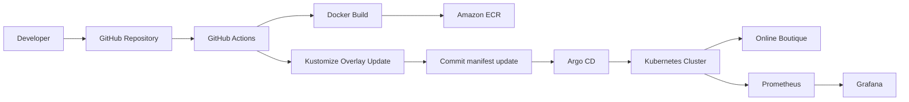
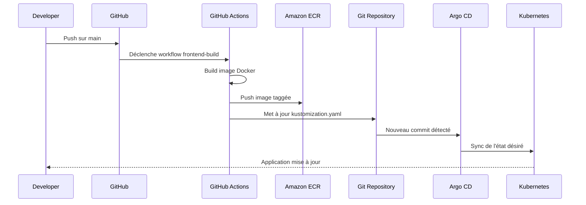
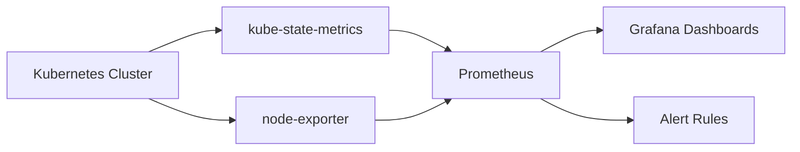

# Online Boutique AWS Secure

This project is a cloud and DevOps implementation built around the open-source **Online Boutique** application from [GoogleCloudPlatform/microservices-demo](https://github.com/GoogleCloudPlatform/microservices-demo). The original application is a sample cloud-first microservices e-commerce app showcasing Kubernetes, gRPC, and distributed services.

The application workload itself is not an original product developed from scratch in this repository. The main contribution of this project is the design and implementation of the surrounding platform: AWS infrastructure provisioning with Terraform, container image management with Amazon ECR, Kubernetes deployment on EKS, CI automation with GitHub Actions, GitOps delivery with Argo CD, and observability with Prometheus and Grafana.

The goal of the project is to demonstrate how an existing open-source microservices application can be adapted, deployed, automated, observed, and hardened in a production-oriented AWS environment. Instead of focusing on business feature development, the emphasis is on platform engineering, deployment workflows, reliability, and operational visibility.

> Note: this repository uses the open-source Online Boutique application as the application reference workload. The focus here is on the AWS, Kubernetes, CI/CD, GitOps, monitoring, and security implementation around that application.


Projet **Cloud / DevOps** de bout en bout autour de l'application *Online Boutique* déployée sur Kubernetes avec une chaîne complète CI/CD, GitOps et observabilité. Le dépôt montre comment construire une image Docker, la publier dans Amazon ECR, mettre à jour les manifests Kustomize via GitHub Actions, puis laisser Argo CD synchroniser automatiquement ou manuellement l'état du cluster à partir de Git.

## Aperçu

Ce projet met en œuvre une architecture DevOps moderne autour de plusieurs briques complémentaires : AWS pour l'infrastructure et le registre d'images, Kubernetes pour l'orchestration, GitHub Actions pour la CI, Argo CD pour le GitOps, et Prometheus/Grafana pour la supervision.

## Infrastructure as Code

L’infrastructure AWS de ce projet est gérée avec **Terraform** afin de garantir un déploiement reproductible, versionné et maintenable.

La couche Infrastructure as Code permet de provisionner et d’organiser les principales briques cloud utilisées par la plateforme :

- VPC et composants réseau
- Subnets publics et privés
- Internet Gateway et NAT Gateway
- Cluster Amazon EKS
- Registres Amazon ECR

L’utilisation de Terraform permet de limiter les changements manuels dans la console AWS, de réduire la dérive de configuration et d’aligner l’infrastructure avec une démarche DevOps pilotée par le code.

## Stack technique

- AWS ECR, pour stocker les images Docker.
- Kubernetes, pour exécuter les microservices.
- Kustomize, pour gérer les overlays d'environnement.
- GitHub Actions, pour builder, tagger et publier les images puis mettre à jour les manifests Git.
- Argo CD, pour synchroniser l'état désiré depuis Git vers le cluster Kubernetes.
- Prometheus + Grafana, pour les métriques, dashboards et alertes.
- Terraform, pour l'infrastructure as code du projet.

## Architecture

Le dépôt contient le code applicatif, les manifests Kubernetes, l'infrastructure Terraform et la pipeline CI/CD. Les diagrammes Mermaid sont particulièrement adaptés aux README GitHub car ils sont rendus nativement et restent faciles à maintenir en texte.



## Architecture Devops

Cette architecture présente l’environnement AWS, le cluster EKS, la chaîne CI/CD avec GitHub Actions et Amazon ECR, le déploiement GitOps avec Argo CD, ainsi que la supervision via Prometheus et Grafana.

<p align="center">
  
</p>

## Flux CI/CD

Le pipeline suit une logique GitOps simple : un changement sur le frontend déclenche un build d'image, l'image est poussée dans ECR, puis le tag est injecté dans l'overlay Kustomize avant d'être poussé dans Git. Argo CD détecte alors ce nouveau commit et resynchronise l'application dans le cluster.



## Observabilité

La supervision repose sur Prometheus pour la collecte des métriques et Grafana pour leur visualisation. Cette combinaison est une pratique courante pour le monitoring Kubernetes et permet de suivre l'état des nœuds, des pods, des workloads et d'ajouter des alertes opérationnelles utiles.

Le monitoring du projet repose sur **Prometheus** et **Grafana**, déployés via une stack de supervision Kubernetes. Dans l’état actuel du projet, les tableaux de bord s’appuient principalement sur des métriques d’infrastructure et des métriques natives Kubernetes, plutôt que sur des métriques applicatives personnalisées.

Les principales sources de métriques utilisées sont :

- **node-exporter**, pour les métriques système des nœuds, comme le CPU, la mémoire, le disque et le réseau.[web:919]
- **kube-state-metrics**, pour les métriques liées à l’état des objets Kubernetes, comme les pods, les déploiements, les replicas et les redémarrages.
- **métriques conteneurs et pods**, pour observer la consommation mémoire et CPU des workloads déployés dans le cluster.

Exemples de métriques exploitées dans les dashboards ou les alertes :

- `node_cpu_seconds_total`
- `node_memory_MemAvailable_bytes`
- `node_filesystem_size_bytes`
- `kube_pod_container_status_restarts_total`
- `kube_deployment_spec_replicas`
- `kube_deployment_status_replicas_available`
- `container_memory_working_set_bytes`

Ces métriques permettent de suivre la santé des nœuds, le comportement des pods, la disponibilité des déploiements, la fréquence des redémarrages ainsi que la consommation des ressources du cluster.

## Structure du dépôt

```text
.
├── .github/workflows/                  # Workflows GitHub Actions
├── microservices-demo/                 # Code source de l'application
├── online-boutique-aws-secure/k8s/     # Manifests Kubernetes et overlays Kustomize
├── terraform/                          # Infrastructure as Code
└── Documentation/                      # Documentation complémentaire
```

## Fonctionnalités réalisées

- Build et push automatique de l'image frontend dans Amazon ECR.
- Mise à jour automatique du tag d'image dans `kustomization.yaml` via GitHub Actions.
- Déploiement GitOps avec Argo CD à partir du dépôt Git.
- Dashboards Grafana pour les métriques système et Kubernetes.
- Base de supervision prête pour des alertes sur pods, disponibilité et mémoire.

## Déploiement

### 1. Build et push de l'image

Le workflow GitHub Actions construit l'image frontend et la pousse dans ECR à chaque modification du frontend ou du workflow concerné.

### 2. Mise à jour des manifests

Après le push de l'image, le workflow met à jour l'overlay Kustomize dans `online-boutique-aws-secure/k8s/overlays/dev/app/` afin que Git reste la source de vérité du déploiement.

### 3. Synchronisation Argo CD

Argo CD compare l'état réel du cluster avec l'état déclaré dans Git, détecte les écarts et applique la synchronisation demandée ou automatique selon la politique choisie.

## Monitoring

La stack `kube-prometheus-stack` fournit une base complète pour superviser le cluster et les workloads Kubernetes. Grafana peut ensuite consommer Prometheus comme source de données pour afficher des dashboards communautaires ou personnalisés.

Exemples de dashboards utiles :

- Node Exporter Full.
- Kubernetes Dashboard.
- Kubernetes Monitoring Dashboard.

## Ce projet démontre

- CI/CD moderne sur GitHub Actions.
- Gestion déclarative de Kubernetes avec Kustomize.
- GitOps avec Argo CD.
- Observabilité avec Prometheus et Grafana.
- Structuration claire d'un dépôt technique avec README et schémas Mermaid, ce qui améliore la lisibilité et la maintenance du projet.

## Améliorations possibles

- Ajouter un environnement `staging` séparé avec un overlay Kustomize dédié.
- Ajouter des alertes Grafana ou Alertmanager plus avancées sur les pods et les déploiements.
- Instrumenter les microservices avec de vraies métriques applicatives Prometheus afin d'aller au-delà du monitoring infra/Kubernetes.
- Ajouter des captures d'écran Grafana et Argo CD dans le dépôt pour renforcer la démonstration visuelle du projet.

## Démarrage rapide

```bash
# Cloner le dépôt
 git clone <repo-url>
 cd <repo>

# Déployer les manifests Kubernetes
 kubectl apply -k online-boutique-aws-secure/k8s/overlays/dev/app

# Accéder à Argo CD
 kubectl port-forward svc/argocd-server -n argocd 8081:443

# Accéder à Grafana
 kubectl port-forward svc/kube-prometheus-stack-grafana -n monitoring 3000:80
```

## Captures à ajouter dans le repo
### Argo CD


### Application


### Monitoring


## Upstream project

This project is based on the open-source **Online Boutique** sample application maintained by Google Cloud:

- Upstream repository: [GoogleCloudPlatform/microservices-demo](https://github.com/GoogleCloudPlatform/microservices-demo) 
- Project description: sample cloud-first application with 10 microservices showcasing Kubernetes, Istio, and gRPC 
- Original license: see the upstream repository license 

This repository extends that application with an AWS-focused platform implementation including Terraform, EKS, ECR, GitHub Actions, Argo CD, Prometheus, and Grafana.

## Licence
BRAY MADOUE KAGONGBE